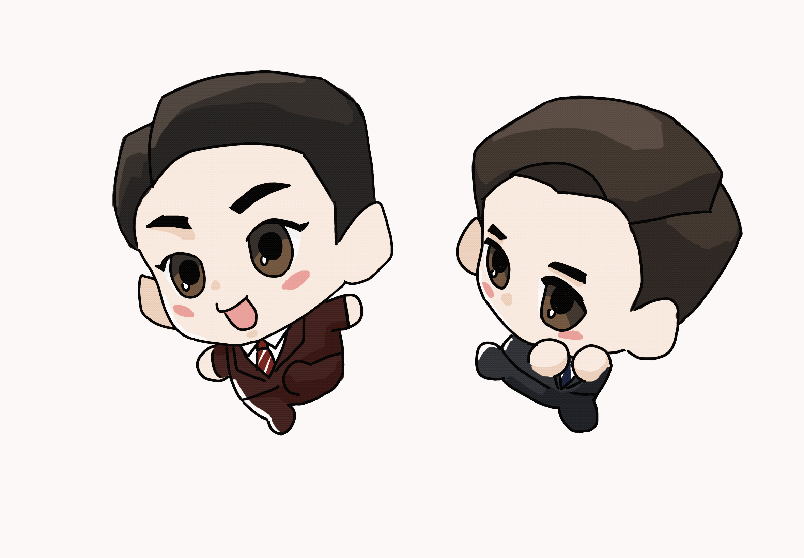

# 🐾 Shimok & Dongjae Desktop Pet

This is a Python project of a desktop pet featuring my favourite characters **Shimok** and **Dongjae** from the K-drama *Stranger*.

## 📦 Tech Stack
- **Python** with [Kivy](https://kivy.org/) for GUI and animation
- Original code based on [this tutorial (Bilibili)](https://www.bilibili.com/video/BV1H1QPYJEAA/?spm_id_from=333.1007.top_right_bar_window_default_collection.content.click&vd_source=c4d81b01f0d7accc2eea854dc487972a)
- With additional help from ChatGPT for customization and optimization

## 🎨 Artwork
All animations are hand-drawn by me, using templates referenced from:
- [Template 1](http://xhslink.com/m/30P4Oo5BbT7)
- [Template 2](http://xhslink.com/m/7nlS5ITJaUR)
- [Template 3](http://xhslink.com/m/37EpkTHceMD)
- [Template 4](http://xhslink.com/m/63HFQjpeynt)

## ✨ Features
- **Default animation**:  
  - Click once → stop moving  
  - Click again → stop animating  
  - Hold & drag → move freely
- **Switch animations**: Select and change to different animations
- More features planned in the future...

## 📹 Coming Soon
A video tutorial for installation and usage will be recorded.

## 📷 Preview

### 🐾 Animated Pet

### 🎬 And the prosecutors themselves...

Made with ❤️ — feel free to contribute or file issues.